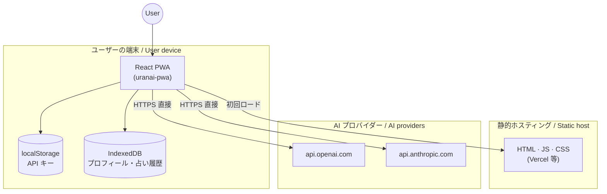
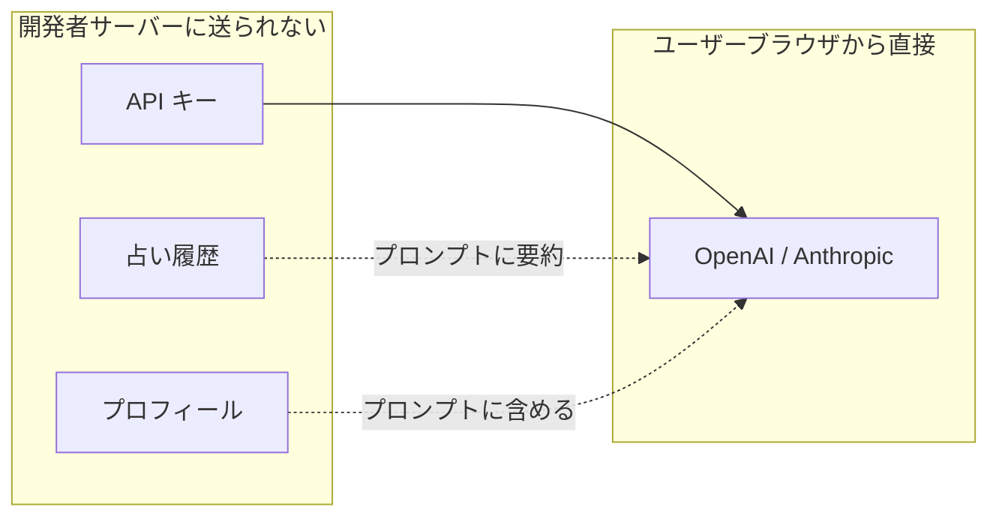

# アーキテクチャ / Architecture

[← ドキュメント一覧](README.md) · [English section ↓](#english)

## システム構成

## レイヤー

| レイヤー | ディレクトリ | 役割 |
|----------|--------------|------|
| UI | `src/screens/` | 画面・ルーティング先 |
| 状態 | `src/hooks/` | 占い生成・プロフィール |
| AI | `src/ai/` | プロンプト組み立て・API 呼び出し |
| 永続化 | `src/db/` · `src/storage/` | IndexedDB · localStorage |
| PWA | `vite.config.ts` | Service Worker · マニフェスト |

## プライバシー境界

- 開発者の CDN には **アプリコードのみ** が置かれる
- 占いリクエストは Service Worker 上で `NetworkOnly`（キャッシュしない）

---

## English

### System layout

The PWA runs entirely in the browser. On first visit, static assets load from a CDN (e.g. Vercel). After setup, the user’s API key lives in `localStorage`; profile and fortune history live in IndexedDB. Fortune requests go **directly** from the browser to OpenAI or Anthropic — no app backend.

### Layers

| Layer | Path | Role |
|-------|------|------|
| UI | `src/screens/` | Screens & route targets |
| State | `src/hooks/` | Fortune generation & profile |
| AI | `src/ai/` | Prompts & API client |
| Storage | `src/db/` · `src/storage/` | IndexedDB · localStorage |
| PWA | `vite.config.ts` | Service worker & manifest |

### Privacy boundary

Data marked “never on developer server” stays on the device except when the user explicitly sends a fortune request to an AI provider. The developer only hosts read-only static files.
