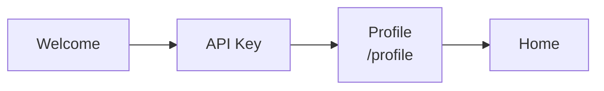
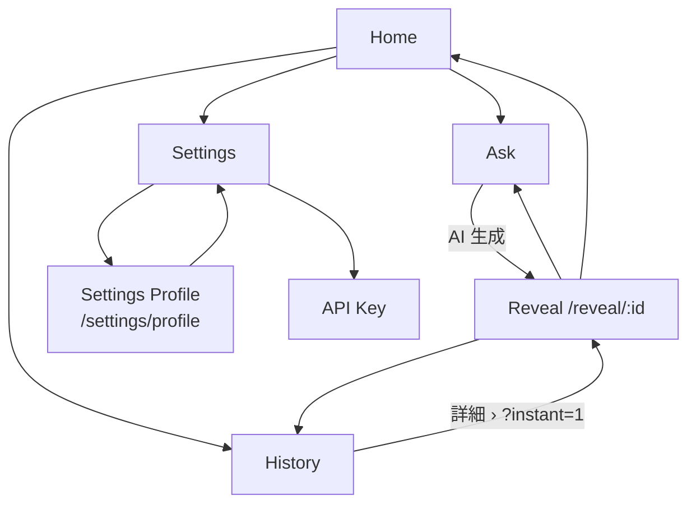
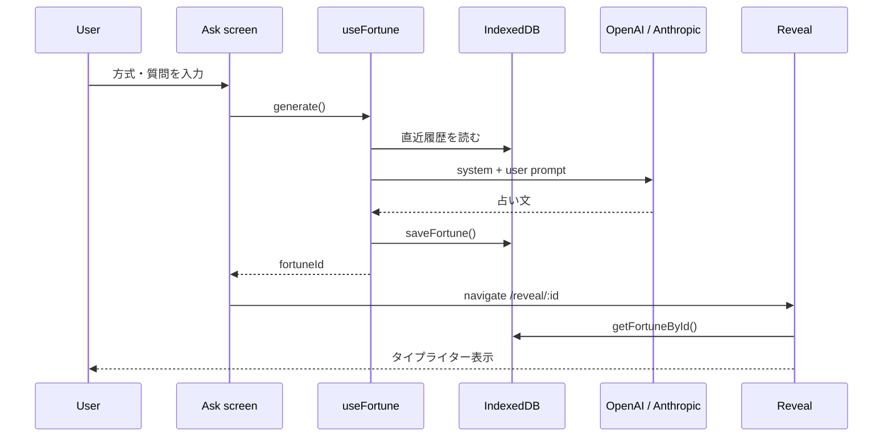

# 画面フロー / Screen Flow

[← ドキュメント一覧](README.md) · [English section ↓](#english)

## ルート一覧

| パス | 画面 | ガード |
|------|------|--------|
| `/` | Welcome | なし |
| `/api-key` | API キー設定 | なし |
| `/api-key-help` | キー取得ガイド | なし |
| `/profile` | プロフィール（初回） | API キー必須 |
| `/settings/profile` | プロフィール（編集） | プロフィール必須 |
| `/home` | ホーム | プロフィール必須 |
| `/ask` | 占い入力 | プロフィール必須 |
| `/reveal/:id` | 結果表示 | プロフィール必須 |
| `/history` | 履歴 | プロフィール必須 |
| `/settings` | 設定 | プロフィール必須 |

ルーティングは `HashRouter` のため、実 URL は `https://example.com/#/home` 形式。

## 初回オンボーディング

## メインフロー

## 占い生成シーケンス

---

## English

### Routes

Same table as above — all paths are hash-based (`/#/home`, etc.).

### Onboarding

`Welcome → API key → Profile (/profile) → Home`

### Main loop

From Home, users can start a reading (`Ask`), browse `History`, or open `Settings`. After AI generation, `Reveal` shows the result with a typewriter effect. Invalid or missing fortune IDs show an error state with navigation options.

### Fortune sequence

`Ask` calls `useFortune.generate()`, which loads recent history from IndexedDB, calls the chosen AI provider, saves the result, then navigates to `Reveal/:id`.
